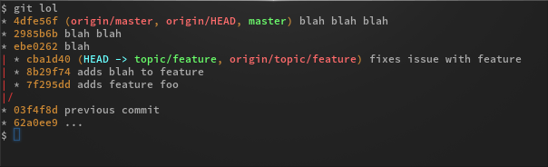

# useful git aliases
{:.no_toc}

* toc
{:toc}

## unstage

There is a git command to add a file to the staging area: `git stage`. It is a synonym, not an alias, to `git add`. However, there is no corresponding `git unstage` to unstage a file. The following alias fills this void:

```console
$ git config --global alias.unstage 'reset HEAD --'
```

This alias is from the official [pro git][pro-git-aliases] e-book.


## log graph

The `git log` command has a lot of options. A very useful combination of options is the visual representation of the project history, similar to `gitk` but without the GUI:

```console
$ git config --global alias.lol \
'log --graph --decorate --pretty=oneline --abbrev-commit --all'
```

This set of options prints a pretty textual representation of the project history:



The origin of the `git lol` alias is [this blog entry][git-lol-origin].


## in case of fire

In case the fire alarm sounds in your office you are supposed to leave the building immediately. However, you don't want to leave your changes uncommitted to be consumed by fire, so you want to quickly push your work.

Print this out and tape it on the door, your git-capable colleagues will love it (from [this repo][git-fire]):


There is a git workflow to save your progress without disrupting other peoples work, to avoid all colleagues pushing to the same branch.

```bash
# checkout new unique branch
git checkout -b fire/$USER

# stage and commit everything
git stage -A
git commit -m 'WIP: fire alert!'

# push it
git push origin fire/$USER
```

Since you want to avoid having to remember all of this when it really burns, you can create an alias that takes care of this:

```console
$ git config --global alias.fire \
'!sh -c "git checkout -b wip/fire/$USER && \
         git stage -A && \
         git commit -m wip-fire-alert && \
         git push origin wip/fire/$USER"'
```

Alternatively, you can use this shell script, name it `git-fire`, make it executable and put it on your `PATH`:

```bash
#!/bin/bash

FIRE_BRANCH="wip/fire/$USER-$(date +%s)"

git checkout -b "$FIRE_BRANCH" &&
git stage -A &&
git commit -m 'WIP: fire alert!' &&
git push origin "$FIRE_BRANCH"
```

---

[back to index](index.html)


[pro-git-aliases]: https://git-scm.com/book/en/v2/Git-Basics-Git-Aliases
[git-lol-origin]: http://uberblo.gs/2010/12/git-lol-the-other-git-log
[git-fire]: https://github.com/louim/in-case-of-fire
